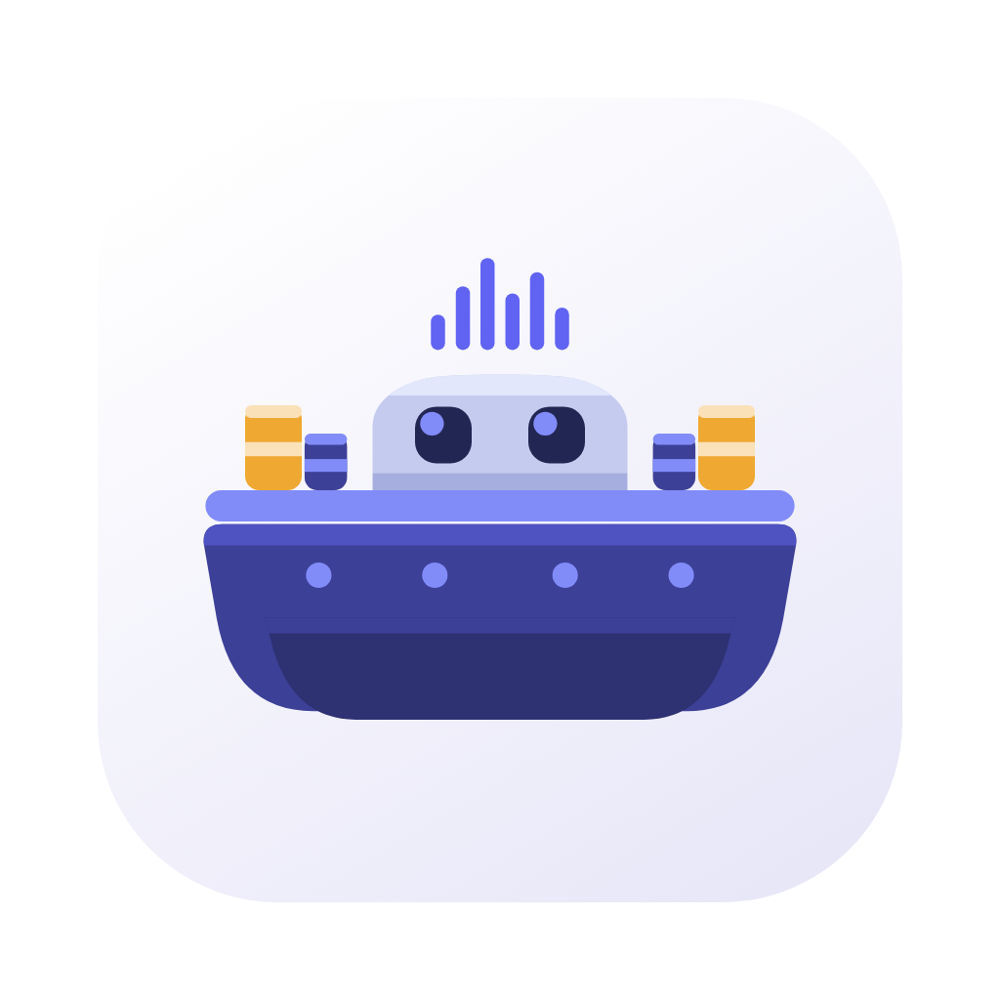

<div align="center">



# Sonarche

**From the stream into the Ark.**

A desktop music library that files, tags and plays your collection — and keeps it
as plain files you own, long after the app that made them is gone.

[](CHANGELOG.md)
[](#install)
[](LICENSE)

**English** · [Français](README.fr.md)

</div>

---

## Why it exists

Streaming services lend you music. A folder of tagged files is yours.

Sonarche is the tool for keeping the second kind: it takes a pile of audio files —
however they got there — identifies them by listening to them, writes real tags,
files them into a clean tree, and gives you a player and a browser over the
result. Underneath it is [beets](https://beets.io), the reference library manager,
with its SQLite index as the single source of truth. Nothing is locked in: point
another player at the same folder tomorrow and everything still works.

## What it does

**Identifies tracks by their sound, not their filename.** Every file is
fingerprinted with [Chromaprint](https://acoustid.org/chromaprint) and looked up
against [AcoustID](https://acoustid.org), then resolved to a
[MusicBrainz](https://musicbrainz.org) release. A track whose filename is
`audio_04_final.m4a` comes out with its real title, artist, album, year and track
number. Where the fingerprint finds nothing, the app says so rather than guessing
silently.

**Files everything into one tree.** Albums land at
`Artist/Album/01 Title.m4a`, with a 500 px cover beside them for display and the
original archived next to it. The whole library moves to another disk in one
click, index and all.

**Browses the collection five ways.** Tracks, albums, artists, genres and your
own categories (Film, Video Games, …), all virtualised so a library of thousands
scrolls at full speed.

**Plays it natively.** A Rust audio engine — not a webview `<audio>` element —
with a queue, shuffle, repeat, gapless playback, synchronised lyrics, and proper
OS media-key and Control Center integration.

**Tells you what is wrong.** A metadata page triages the library: what is
untagged, what looks suspicious, what the fingerprint contradicts — with a
one-click path to each offender.

**Imports what you already have.** Point it at fifteen years of folders; it
scans, reports what it found, copies (never moves), and enriches in place.
Everything it fetches from the outside world is paced by rate limits you set
yourself.

Adding a track from a web link is one of the ways in, alongside importing files
you already have.

<!-- TODO: a screenshot of the library view, both themes, before this ships.
     docs/screenshots/library-{light,dark}.png -->

## Install

Grab the build for your machine from the
[latest release](https://github.com/Norudah/sonarche/releases/latest).

| Machine                    | File                           |
| -------------------------- | ------------------------------ |
| Mac, Apple Silicon (M1–M4) | `Sonarche_x.y.z_aarch64.dmg`   |
| Mac, Intel                 | `Sonarche_x.y.z_x64.dmg`       |
| Windows 10/11, 64-bit      | `Sonarche_x.y.z_x64-setup.exe` |

Not sure which Mac you have? Run `uname -m` — `arm64` is Apple Silicon,
`x86_64` is Intel. Windows on ARM runs the x64 build under emulation.

The `.tar.gz` and `.sig` files in the same release are the updater's plumbing.
You do not need them.

Nothing else is required: the app carries its own Python runtime and installs
its tools into a folder it owns. Your system Python is never touched.

### First launch on macOS

Sonarche is signed, but not _notarised_ — that needs a paid Apple Developer
account, and this app does not have one. Apple's notarisation proves who wrote
a program, not that the program is any good; without it macOS shows a warning
the first time, and only the first time.

> **Do not click the blue button.** It says _Move to Trash_.

1. Open Sonarche. macOS says _"Apple could not verify Sonarche is free of
   malware"_. Click **Done**.
2. Open **System Settings → Privacy & Security**, scroll to the bottom, to the
   **Security** section. A line about Sonarche is waiting there.
3. Click **Open Anyway**, authenticate, then **Open**.

That line expires about an hour after the failed launch. If it is not there,
try opening the app again and go back to Settings.

You will not see this again — later updates are written by the app's own
updater, which does not mark files as quarantined.

<!-- TODO: the real Gatekeeper dialog, macOS 15.6.1 — the screenshot Romain took
     on 2026-07-28. docs/screenshots/macos-gatekeeper.png -->

### First launch on Windows

SmartScreen shows _"Windows protected your PC"_ on the first download, for the
same reason: the installer is not signed by a paid certificate. Click **More
info → Run anyway**.

The installer is per-user, so there is no UAC prompt — at install or at update.

### First run

The app opens on a short walkthrough that builds its environment: it unpacks
the bundled Python, installs `yt-dlp` and `beets` into a virtual environment of
its own, and asks for a free [AcoustID API key](https://acoustid.org/new-application).

The key is optional and strongly recommended — without it, tracks are tagged
from whatever hints are available instead of being identified. It is stored in
the OS keychain, never in a config file, and never reaches the interface once
saved.

The first run takes about fifteen seconds and needs no network, because the
Python wheels ship inside the bundle.

## How it works

```
┌──────────────────────────────────────────────┐
│  React + HeroUI webview                      │  what you see
└───────────────┬──────────────────────────────┘
                │  Tauri IPC (typed commands, events)
┌───────────────┴──────────────────────────────┐
│  Rust core                                   │  audio engine, jobs,
│  rodio · rusqlite · keyring                  │  history, OS integration
└───────────────┬──────────────────────────────┘
                │  one stdio channel, NDJSON, one request per line
┌───────────────┴──────────────────────────────┐
│  Python sidecar (app-owned venv)             │  yt-dlp, beets,
│  yt-dlp · beets · mutagen · Pillow           │  MusicBrainz, AcoustID
└───────────────┬──────────────────────────────┘
                │
        ┌───────┴────────┐
        │  beets library │  audio files + SQLite index
        │  (your files)  │  ← the source of truth
        └────────────────┘
```

A few rules the code holds to:

- **The beets library is the source of truth.** The app reads its SQLite index
  and never writes to it directly — every write goes through beets itself.
- **The system Python is never touched.** Every install goes into an app-owned
  virtual environment, from wheels pinned in a lockfile.
- **No lossy re-encoding.** A native AAC stream is kept as it arrives.
- **`stdout` carries protocol JSON only.** Every log line goes to `stderr`, and
  from there to a rotating file, because a GUI process on Windows has no console.
- **The sidecar dies with the app.** Its environment is health-checked at every
  launch and rebuilt if broken.

### Supported formats

Playback and import cover `mp3`, `flac`, `m4a`, `m4b`, `mp4`, `aac`, `ogg`,
`wav`, `aiff`. An `.ogg` carrying Opus rather than Vorbis is the one case the
extension cannot settle; it is reported as an error rather than skipped
silently.

### Where things live

|          | macOS                                                  | Windows                            |
| -------- | ------------------------------------------------------ | ---------------------------------- |
| Music    | `~/Music/Sonarche`                                     | `%USERPROFILE%\Music\Sonarche`     |
| App data | `~/Library/Application Support/com.rpierucci.sonarche` | `%APPDATA%\com.rpierucci.sonarche` |
| Logs     | `…/logs/sonarche.log`                                  | `…\logs\sonarche.log`              |

The music folder is movable from **Settings → Library**; the app data folder is
not. Everything under app data is rebuildable — the Python runtime, the venv,
the download history — except the beets index, which travels with the music.

## Development

Requirements: Node 22 (see `.nvmrc`), a Rust toolchain, and a Python 3.10+ on
`PATH` for running the sidecar's tests.

```bash
npm install
npm run tauri dev
```

`npm run tauri dev` fetches the bundled Python runtime on first run
(`scripts/prepare-runtime.mjs`, ~24 MB, cached and gitignored).

### The commands that gate a change

```bash
npm run lint && npx tsc --noEmit && npm test    # front
cd src-tauri && cargo clippy --all-targets && cargo fmt && cargo test
cd sidecar && python -m unittest discover -p "*_test.py"
npm run format                                  # prettier, 120 columns
```

All three suites must be green before a change is done. CI runs the same
commands on the release pull request.

### Previewing the interface without a backend

The webview runs in a plain browser against a mock IPC layer — useful for
design work, and the only way to reach a screen whose real state is hard to
reproduce:

```bash
npm run dev
```

then `http://localhost:1420/?mockTauri`. A few query parameters go with it:
`&route=/library/albums` lands on a nested view, `&onboarding=1` forces the
walkthrough, `&update` shows the update prompt, `&splash=3000` holds the launch
splash open long enough to look at.

### Layout

```
src/                 React app
  app/               shell: routing, layout, providers, design tokens
  features/<domain>/ business UI, hooks, IPC calls, locales
  shared/            agnostic reusable pieces (player, motion, ui)
src-tauri/src/       Rust core — one module per concern
sidecar/             Python sidecar; *_test.py beside each module
scripts/             build tooling (runtime fetch, lockfile check)
docs/                brand assets and design notes
```

`shared` imports nothing app-level, `features` may import `shared`, `app`
imports both. No cross-feature imports. Everything goes through the `@/` alias.

### Releases

Versions are handled by [release-please](https://github.com/googleapis/release-please).
Merging `develop` into `main` opens a release pull request that bumps
`package.json`, `Cargo.toml` and `tauri.conf.json` together and writes
[`CHANGELOG.md`](CHANGELOG.md); merging _that_ tags the release and publishes the
bundles. Never tag by hand.

Commits follow [Conventional Commits](https://www.conventionalcommits.org/):
`type(scope): subject`, imperative, no trailing period.

## Built on

[beets](https://beets.io) · [yt-dlp](https://github.com/yt-dlp/yt-dlp) ·
[MusicBrainz](https://musicbrainz.org) · [AcoustID](https://acoustid.org) &
[Chromaprint](https://acoustid.org/chromaprint) ·
[Cover Art Archive](https://coverartarchive.org) · [LRCLIB](https://lrclib.net) ·
[Last.fm](https://www.last.fm) · [Tauri](https://tauri.app) ·
[HeroUI](https://www.heroui.com) · [rodio](https://github.com/RustAudio/rodio)

Please be kind to the free services above: the rate limits in
**Settings → Limitations** exist so this app stays a polite client, and lowering
them is not a feature.

## License

[MIT](LICENSE).

Sonarche is a personal-use tool for managing music you are entitled to keep.
Respect the terms of the services you use it with, and the copyright law where
you live.
